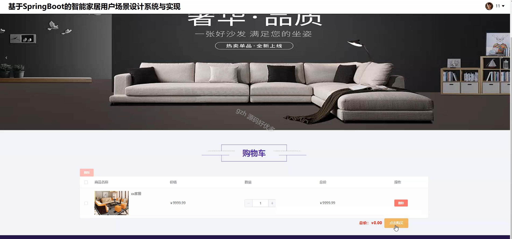
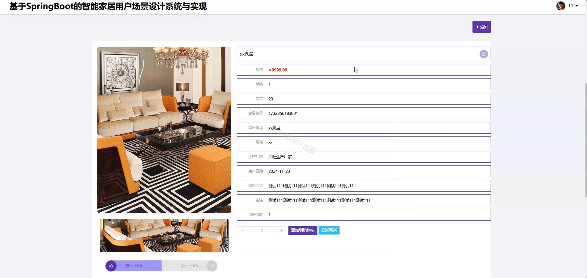
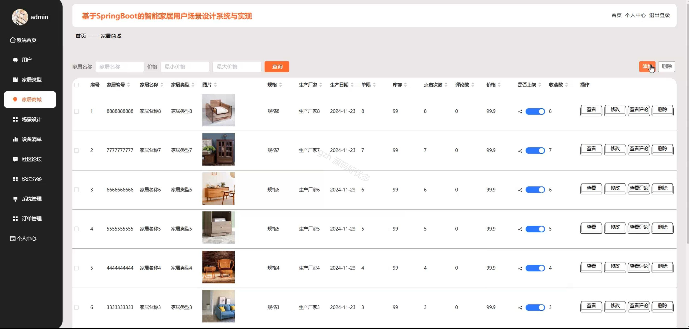
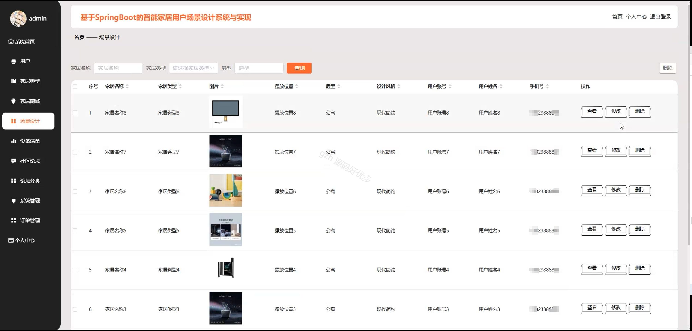
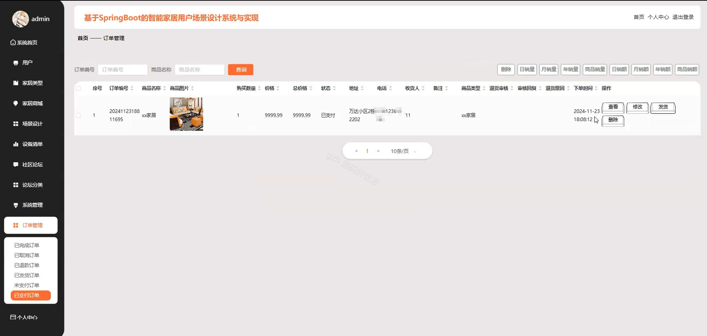
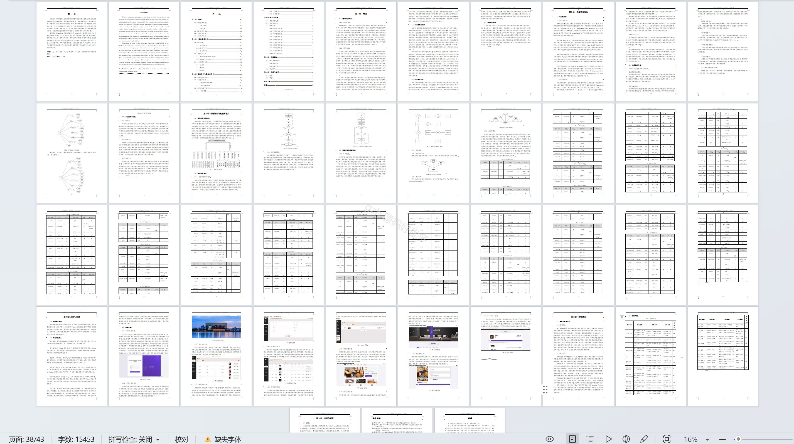

# springbootA223D
springbootA223D智能家居用户场景设计系统+LW
 
## 查看主页获取源码

### 一、关键词
家居商城、场景设计、设备清单

### 二、作品包含
源码+数据库+设计文档万字+全套环境和工具资源+部署教程

### 三、项目技术
前端技术：Html、Css、Js、Vue2.0、Element-ui 
后端技术：Java、SpringBoot2.0、MyBatis

### 四、运行环境（以下版本亲测，其他版本未知，请自测）
开发工具：IDEA/eclipse  + VSCODE

数据库：MySQL5.7（最低要5.7版本）

数据库管理工具：Navicat10以上版本

环境配置软件： JDK1.8 + Maven3.6.3

前端Nodejs：14

浏览器：谷歌浏览器

### 五、项目介绍
项目编号：springbootA223D

智能家居用户场景设计系统可助力用户设计智能家居场景，涵盖设备管理、场景搭建及社区互动等功能，实现家居智能化体验与便捷管理。

角色：管理员、用户

管理员：系统首页、用户、家居类型、家居商城、场景设计、设备清单、社区论坛、论坛分类、系统管理、订单管理、个人中心。

用户：系统首页、家居商城、社区论坛、公告资讯、个人中心、修改密码、场景设计、设备清单、社区论坛、我的发布、我的订单、我的地址、我的收藏。

### 六、运行截图

